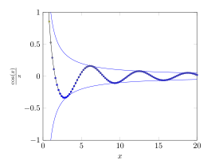
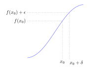

# tikz-examples

I'm trying to collect a handful of tikz figures that I created over the past ~1 year to make it easier for me to create new, better tikz figures. 

## Documentation 

The tikz code I'm sharing generally tends to follow the format of a LaTeX .tex 
file with the following format:

```tex
\documentclass[tikz, margin=3.14mm]{standalone}

% header

\begin{document}
\begin{tikzpicture}
\end{tikzpicture}
\end{document}
```

I render most of them with `pdflatex` and then to create a small-filesize 
image version that is readily shareable on the web, I use a command-line tool
called `pdf2svg` on the output. For example, I run `pdf2svg limit_supremum_infimum.pdf limit_supremum_infimum.svg` to produce the svg file version. 

## Examples 

<a href="limit_supremum_infimum/limit_supremum_infimum.tex">

</a>

Limit supremum and infimum illustrated. 

<a href="continuity_and_differentiability/continuity_and_differentiability.tex">

</a>