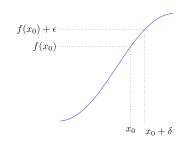
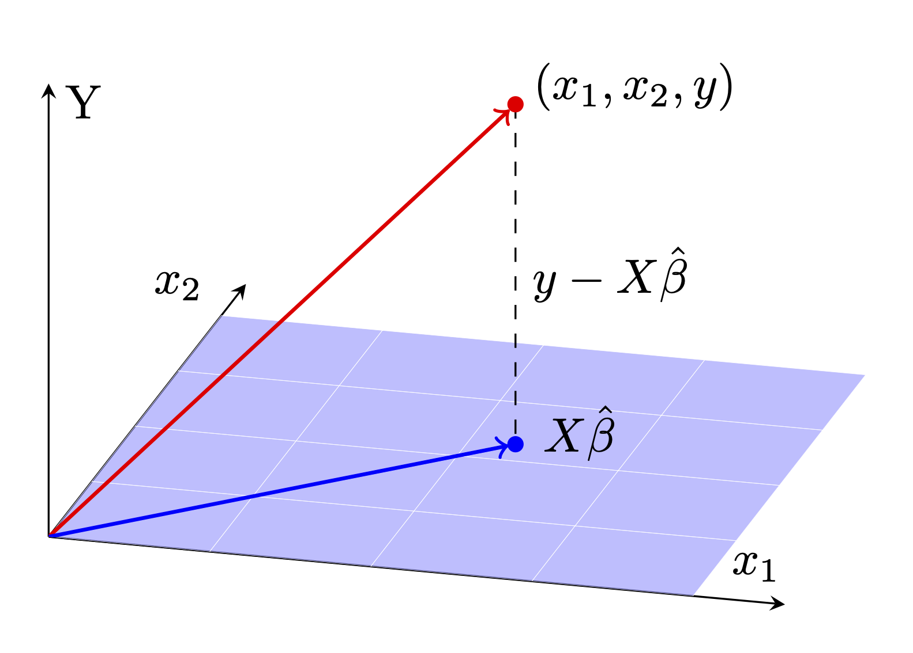
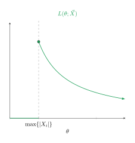
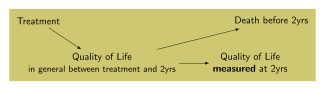
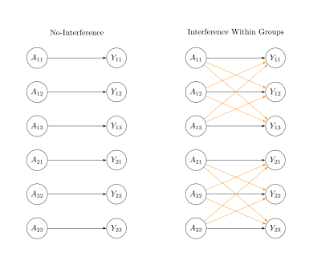
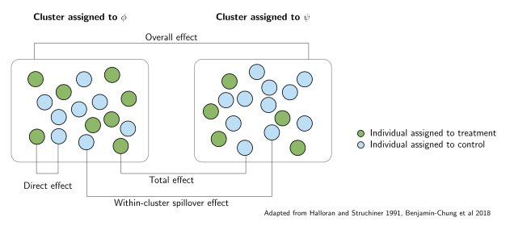
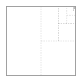

# tikz-examples

I'm trying to collect a handful of tikz figures that I created over the past ~1 year to make it easier for me to create new, better tikz figures. 

## Documentation 

The tikz code I'm sharing generally tends to follow the format of a LaTeX .tex 
file with the following format:

```tex
\documentclass[tikz, margin=3.14mm]{standalone}

% header

\begin{document}
\begin{tikzpicture}
\end{tikzpicture}
\end{document}
```

I render most of them with `pdflatex` and then to create a small-filesize 
image version that is readily shareable on the web, I use a command-line tool
called `pdf2svg` on the output. For example, I run `pdf2svg limit_supremum_infimum.pdf limit_supremum_infimum.svg` to produce the svg file version. 

### Backgrounds 

Most of the examples I share will have something like this added to them: 

```tex
% \documentclass and the rest of the header
\usetikzlibrary{backgrounds}

\begin{document} 
\begin{tikzpicture}[background rectangle/.style={fill=white}, show background rectangle]
% ... 
\end{tikzpicture}
\end{document}
```

The inclusion of a white rectangle in the background is, in almost all cases, just so that the 
rendered diagrams can be easily seen in this readme while browsing GitHub in dark mode, or 
while viewing the readme in other software with a dark mode such as VS Code. The background
is totally optional, and removing the tikz library and tikzpicture style settings 
described above should remove it if you need to. 

### Similar Projects

  - [TikZ and PGF Examples from texample.net](https://texample.net/tikz/examples/)
  - [Awesome TikZ by xiaohanyu (GitHub)](https://github.com/xiaohanyu/awesome-tikz)
  - [tikz examples on Overleaf](https://www.overleaf.com/latex/examples/tagged/tikz)
  - [TikZ Gallery by Lauren Williams](https://www.integral-domain.org/lwilliams/Resources/tikzsnippets.php)
  - [Nice scientific pictures show off (tex.stackexchange)](https://tex.stackexchange.com/questions/158668/nice-scientific-pictures-show-off)
  - [TikZ is All You Need (slides)](https://mkofinas.github.io/tikz_tutorial.pdf)
  - [Walmes Zeviani - TikZ Gallery](http://leg.ufpr.br/~walmes/Tikz/)


## Examples 

<p align="center">
<a href="2023/limit_supremum_infimum/limit_supremum_infimum.tex">

</a>
</p>

Limit supremum and infimum illustrated. 

--- 

<p align="center">
<a href="2023/continuity_and_differentiability/continuity_and_differentiability.tex">

</a>
</p>

$\delta$ & $\epsilon$ as commonly used in defining continuity. 

--- 

<p align="center">
<a href="2023/cone/cone.tex">

</a>
</p>

Example of a height 1, radius 1 cone. 

Based off of responses here: <https://tex.stackexchange.com/questions/171169/how-to-draw-a-simple-cone-with-height-and-radius-with-tikz>

--- 

<p align="center">
<a href="2023/convexity/convexity.tex">

</a>
</p>

Illustrating convexity.

--- 

<p align="center">
<a href="2023/lagrange_multipliers/lagrange_multipliers.tex">

</a>
</p>

Optimization subject to a constraint, e.g., minimizing f subject to the constraint g. 

--- 

<p align="center">
<a href="2023/convergence_implications/convergence_implications.tex">

</a>
</p>

The implication graph of different kinds of asymptotic convergence.

--- 

<p align="center">
<a href="2023/intersection/intersection.tex">

</a>
</p>

Definition of intersection.

--- 

<p align="center">
<a href="2023/scientific_process/scientific_process.tex">

</a>
</p>

Diagram describing the role of statistical methods in the scientific process.

--- 

<p align="center">
<a href="2023/pr_density_of_linear_model/pr_density_of_linear_model.tex">

</a>
</p>

Probability density in a linear model. 

Based on <https://pgfplots.net/heteroskedasticity-linear-regression/>

--- 

<p align="center">
<a href="2023/normal_equation_projection/normal_equation_projection.tex">

</a>
</p>

Regression viewed as projection.

--- 

<p align="center">
<a href="2023/residual_decompositions/residual_decomposition.tex">

</a>
</p>

Decomposing total sum of squares into sum of squared errors and regression sum of squares.

--- 

<p align="center">
<a href="2023/lasso/lasso.tex">

</a>
</p>

LASSO penalization.

--- 

<p align="center">
<a href="2023/time_dependent_exposures1/time_dependent_exposures1.tex">

</a>
</p>

Time-varying confounding as per the 2000 paper on marginal structural models by Hernán, Brumback, and Robins.

--- 

<p align="center">
<a href="2023/converging_normals/converging_normals.tex">

</a>
</p>

Convergence in distribution. 

--- 

<p align="center">
<a href="2023/semidefiniteness/semidefiniteness.tex">

</a>
</p>

Semidefiniteness. 

--- 

<p align="center">
<a href="2023/geometric_sum/geometric_sum.tex">

</a>
</p>

Geometric random variables model the probability of getting k failures before the rth success. 

--- 

<p align="center">
<a href="2023/math_lineage/math_lineage.tex">

</a>
</p>

Mathematical lineage of one of the faculty I work with. 

--- 


<p align="center">
<a href="2023/ellipse_and_vectors/ellipse_and_vectors.tex">

</a>
</p>

Major and minor axes of the ellipse described by the data covariance. 

--- 

<p align="center">
<a href="2023/matrix_and_scatter/standalone_scatter_with_marginal_histograms.tex">

</a>
</p>

Marginal histograms. 

--- 

<p align="center">
<a href="2023/determinant_and_rotation_3d/determinant_3d.tex">

</a>
</p>

Rotation in 3D. 

--- 

<p align="center">
<a href="2023/bivariate_normal/bivariate_normal.tex">

</a>
</p>

Bivariate normal distribution. 

--- 

<p align="center">
<a href="2023/covariance/covariance.tex">

</a>
</p>

Diagram of a covariance matrix. 

\* I think this one may have compilation issues, just fair warning.

--- 

<p align="center">
<a href="2024/log_likelihood/figure.tex">

</a>
</p>

A log-likelihood with an inclusive boundary. 

--- 

<p align="center">
<a href="2024/samples_epsilon_away/samples_epsilon_away.tex">

</a>
</p>

Sample observations that are $\epsilon/\sqrt{n}$ away from their limits, $-theta$ to $theta$. 

--- 

<p align="center">
<a href="2024/ternary_tree/ternary_tree.tex">

</a>
</p>

A ternary tree. 

--- 

<p align="center">
<a href="2024/graph_traversal/graph_traversal.tex">

</a>
</p>

Graph traversal. 

---

<p align="center">
<a href="2024/frangakis_rubin/frangakis_rubin.tex">

</a>
</p>

A table from a paper by Frangakis and Rubin on principal stratification. 

---

<p align="center">
<a href="2024/posttreatment/posttreatment.tex">

</a>
</p>

Censoring due to death dependent on posttreatment. 

--- 

<p align="center">
<a href="2024/stratified_interference/stratified_interference.tex">

</a>
</p>

Stratified interference. 

--- 

<p align="center">
<a href="2024/interference_effects/interference_effects.tex">

</a>
</p>

Different causal estimators in the presence of partial/stratified interference. 

--- 

<p align="center">
<a href="2024/halving_squares/halving_squares.tex">

</a>
</p>

Visual proof that $\sum_{n=1}^\infty 1/2^n = 1$. 
