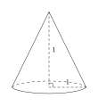

# tikz-examples

I'm trying to collect a handful of tikz figures that I created over the past ~1 year to make it easier for me to create new, better tikz figures. 

## Documentation 

The tikz code I'm sharing generally tends to follow the format of a LaTeX .tex 
file with the following format:

```tex
\documentclass[tikz, margin=3.14mm]{standalone}

% header

\begin{document}
\begin{tikzpicture}
\end{tikzpicture}
\end{document}
```

I render most of them with `pdflatex` and then to create a small-filesize 
image version that is readily shareable on the web, I use a command-line tool
called `pdf2svg` on the output. For example, I run `pdf2svg limit_supremum_infimum.pdf limit_supremum_infimum.svg` to produce the svg file version. 

## Examples 

<center>
<a href="2023/limit_supremum_infimum/limit_supremum_infimum.tex">

</a>
</center>

Limit supremum and infimum illustrated. 

--- 

<center>
<a href="2023/continuity_and_differentiability/continuity_and_differentiability.tex">

</a>
</center>

Delta & epsilon as commonly used in defining continuity. 

--- 

<center>
<a href="2023/cone/cone.tex">

</a>
</center>

Example of a height 1, radius 1 cone. 

Based off of responses here: <https://tex.stackexchange.com/questions/171169/how-to-draw-a-simple-cone-with-height-and-radius-with-tikz>

--- 

<center>
<a href="2023/convexity/convexity.tex">

</a>
</center>

Illustrating convexity.

--- 

<center>
<a href="2023/lagrange_multipliers/lagrange_multipliers.tex">

</a>
</center>

Optimization subject to a constraint, e.g., minimizing $f$ subject to the constraint $g$. 

--- 

<center>
<a href="2023/convergence_implications/convergence_implications.tex">

</a>
</center>

The implication graph of different kinds of asymptotic convergence.

--- 

<center>
<a href="2023/intersection/intersection.tex">

</a>
</center>

Definition of intersection.