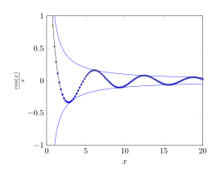
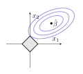
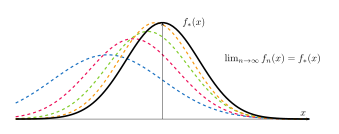

# tikz-examples

I'm trying to collect a handful of tikz figures that I created over the past ~1 year to make it easier for me to create new, better tikz figures. 

## Documentation 

The tikz code I'm sharing generally tends to follow the format of a LaTeX .tex 
file with the following format:

```tex
\documentclass[tikz, margin=3.14mm]{standalone}

% header

\begin{document}
\begin{tikzpicture}
\end{tikzpicture}
\end{document}
```

I render most of them with `pdflatex` and then to create a small-filesize 
image version that is readily shareable on the web, I use a command-line tool
called `pdf2svg` on the output. For example, I run `pdf2svg limit_supremum_infimum.pdf limit_supremum_infimum.svg` to produce the svg file version. 

## Examples 

<center>
<a href="2023/limit_supremum_infimum/limit_supremum_infimum.tex">

</a>
</center>

Limit supremum and infimum illustrated. 

--- 

<center>
<a href="2023/continuity_and_differentiability/continuity_and_differentiability.tex">

</a>
</center>

Delta & epsilon as commonly used in defining continuity. 

--- 

<center>
<a href="2023/cone/cone.tex">

</a>
</center>

Example of a height 1, radius 1 cone. 

Based off of responses here: <https://tex.stackexchange.com/questions/171169/how-to-draw-a-simple-cone-with-height-and-radius-with-tikz>

--- 

<center>
<a href="2023/convexity/convexity.tex">

</a>
</center>

Illustrating convexity.

--- 

<center>
<a href="2023/lagrange_multipliers/lagrange_multipliers.tex">

</a>
</center>

Optimization subject to a constraint, e.g., minimizing $f$ subject to the constraint $g$. 

--- 

<center>
<a href="2023/convergence_implications/convergence_implications.tex">

</a>
</center>

The implication graph of different kinds of asymptotic convergence.

--- 

<center>
<a href="2023/intersection/intersection.tex">

</a>
</center>

Definition of intersection.

--- 

<center>
<a href="2023/scientific_process/scientific_process.tex">

</a>
</center>

Diagram describing the role of statistical methods in the scientific process.

--- 

<center>
<a href="2023/pr_density_of_linear_model/pr_density_of_linear_model.tex">

</a>
</center>

Probability density in a linear model.

--- 

<center>
<a href="2023/normal_equation_projection/normal_equation_projection.tex">

</a>
</center>

Regression viewed as projection.

--- 

<center>
<a href="2023/residual_decompositions/residual_decomposition.tex">

</a>
</center>

Decomposing total sum of squares into sum of squared errors and regression sum of squares.

--- 

<center>
<a href="2023/lasso/lasso.tex">

</a>
</center>

LASSO penalization.

--- 

<center>
<a href="2023/time_dependent_exposures1/time_dependent_exposures1.tex">

</a>
</center>

Time-varying confounding as per the 2000 paper on marginal structural models by Hernán, Brumback, and Robins.

--- 

<center>
<a href="2023/converging_normals/converging_normals.tex">

</a>
</center>

Convergence in distribution. 

--- 

<center>
<a href="2023/semidefiniteness/semidefiniteness.tex">

</a>
</center>

Semidefiniteness. 

--- 

<center>
<a href="2023/geometric_sum/geometric_sum.tex">

</a>
</center>

Geometric random variables. 

--- 

<center>
<a href="2023/math_lineage/math_lineage.tex">

</a>
</center>

Mathematical lineage of one of the faculty I work with. 

--- 


<center>
<a href="2023/ellipse_and_vectors/ellipse_and_vectors.tex">

</a>
</center>

Major and minor axes of the ellipse described by the data covariance. 

--- 

<center>
<a href="2023/matrix_and_scatter/standalone_scatter_with_marginal_histograms.tex">

</a>
</center>

Marginal histograms. 

--- 

<center>
<a href="2023/determinant_and_rotation_3d/determinant_3d.tex">

</a>
</center>

Rotation in 3D. 

--- 

<center>
<a href="2023/bivariate_normal/bivariate_normal.tex">

</a>
</center>

Bivariate normal distribution. 

--- 

<center>
<a href="2023/covariance/covariance.tex">

</a>
</center>

Diagram of a covariance matrix. 

--- 

